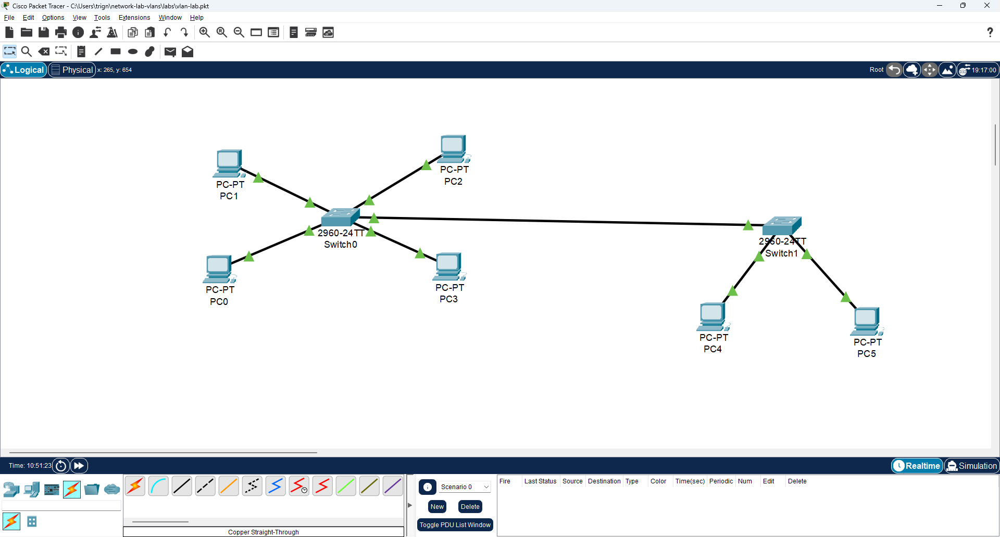

# Proyecto: Laboratorio de VLANs y Trunking

## Objetivo

Diseñar e implementar una red segmentada mediante VLANs para separar tráfico de administración, invitados e IoT.

Implementar una conexión entre switches con vlan usando puertos Trunks.

---

## Dispositivos y direccionamiento

| Dispositivo | Interfaz | Dirección IP     | VLAN |
|------------|----------|------------------|------|
| PC0        | Fa0      | 192.168.10.1     | 10   |
| PC1        | Fa0      | 192.168.10.2     | 10   |
| PC2        | Fa0      | 192.168.20.1     | 20   |
| PC3        | Fa0      | 192.168.30.1     | 30   |
| PC4        | Fa0      | 192.168.10.3     | 10   |
| PC5        | Fa0      | 192.168.20.2     | 20   |

## Configuración de interfaces del switch0

| Interfaz | Modo   | VLAN asignada |
|----------|--------|---------------|
| Fa0/1    | Access | 10            |
| Fa0/2    | Access | 10            |
| Fa0/3    | Access | 20            |
| Fa0/4    | Access | 30            |
| Fa0/24    | Trunk |             |

## Configuración de interfaces del switch1

| Interfaz | Modo   | VLAN asignada |
|----------|--------|---------------|
| Fa0/1    | Access | 10            |
| Fa0/2    | Access | 20            |
| Fa0/24    | Trunk |             |

## Diseño de red

Se ha segmentado la red en tres VLANs independientes, asignando un rango de direcciones IP por cada VLAN:

- VLAN 10 → 192.168.10.0/24
- VLAN 20 → 192.168.20.0/24
- VLAN 30 → 192.168.30.0/24


## Topología



---

## Diseño de red

- VLAN 10 → Administración
- VLAN 20 → Invitados
- VLAN 30 → IoT

- Switch L2 con puertos:
  - Access para hosts
  - Trunk entre switches

---

## Configuración

### Creación de VLANs

```bash
vlan 10
 name ADMIN

vlan 20
 name GUEST

vlan 30
 name IOT
```

### Puertos access

```bash
interface fa0/1
 switchport mode access
 switchport access vlan 10

interface fa0/2
 switchport mode access
 switchport access vlan 10

interface fa0/3
 switchport mode access
 switchport access vlan 20

interface fa0/4
 switchport mode access
 switchport access vlan 30
 
``` 

### Puerto trunk

```bash
interface fa0/24
 switchport mode trunk
 ```
 ## Pruebas
 
 ### Ping dentro de la misma VLAN
 PC0 --> PC1 --> OK
 
 ### Ping entre VLANs
 PC0 --> PC2 --> FAIL
 PC0 --> PC3 --> FAIL
 
  ### Ping dentro de la misma VLAN a través de switches
 PC0 --> PC4 --> OK
 PC0 --> PC5 --> FAIL
 
## Verificación

### VLANs
```bash
show vlan brief
```
## Funcionamiento del trunk

El enlace trunk permite transportar múltiples VLANs mediante etiquetado 802.1Q. Cada frame incluye un identificador de VLAN que permite a los switches mantener la segmentación de la red a través del enlace.

 
### Resultados
 - Los dispositivos dentro de la misma VLAN tienen conectividad
 - Los dispositivos de distinta VLAN no pueden comunicarse
 - La segmentación funciona correctamente
 - El trunk funciona correctamente
 
 ## Conclusión

Se ha implementado correctamente la segmentación mediante VLANs en un switch L2, comprobando aislamiento entre redes y conectividad interna.

## Laboratorio

El archivo de Packet Tracer utilizado en este proyecto está disponible en:

`labs/vlan-lab.pkt`

Permite replicar la topología y configuraciones descritas.
